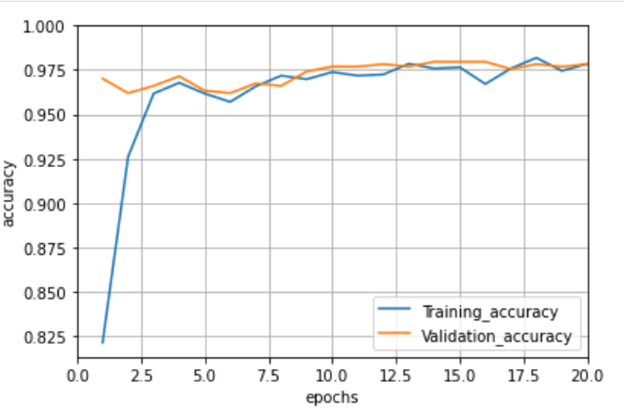
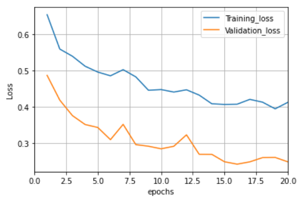

# Coronavirus disease (COVID-19) detection in Chest X-Ray images using majority voting based classifier

## ABSTRACT
One of the most challenging problems in the present world is the novel coronavirus disease (nCOVID-19). A recent study reveals that infected patients exhibit distinct radiographic visual characteristics coupled with fever, dry cough, fatigue, etc. A chest radiograph or a Chest X-Ray (CXR) is one of the clinical adjuncts that plays a vital role in the detection of the visual response associated with SARS-COV-2 infection. In this project, several machine learning algorithms (Logistic Regression, Support Vector Machine with Gaussian Kernel, Support Vector Machine with Linear Kernel, Naïve Bayes, and Decision Tree) and deep learning algorithms (VGG16, and Resnet101) have been used. Moreover, a custom majority voting-based classifier has been built, which will predict the result based on the majority votes of the top five algorithms (w.r.t f1-score). The best classifier's result was obtained with a majority voting-based classifier with the resulting f1-score of 0.9755.

## Project Goal
The goal is to build an automatic screening system that can classify the given patient as a corona positive or negative. The input to our model is the chest x-ray images, and various models (machine learning and deep learning) have been used to predict the output (0 for normal, 1 for Corona).

## Dataset
The data is acquired from two sources:
1.	GitHub repository:  https://github.com/ieee8023/covid-chestxray-dataset. From this source, corona positive patient's x-ray images have been imported. This dataset consists of 930 (shown in Fig1) positive patient x-ray images, and the dimension of each image is 968*768.

2.	Kaggle: https://www.kaggle.com/paultimothymooney/chest-xray-pneumonia. This is a dataset of pneumonia detection problems. As the normal patient’s x-ray image is not available in the git hub repository, so these scans are imported from Kaggle. The dataset consists of 1341 (shown in Fig1)  normal patient x-ray images, and the dimension of each image is 2090 x 1858.

### Frequency Plot of target distribution

## Features
Firstly, images are converted into multi-dimensional NumPy arrays. For this purpose, the imread() method of the OpenCV library has been used. OpenCV library converted images into the array of dimensions (m, h, w) where m is the number of examples and w, h is the number of pixels in width and height. It is always good to have all the images in the same dimension as the total number of pixels in each image represents the number of features. Hence for thiscv2.resize() is used, which converts the picture into specified width and height i.e. (224*224).

## EXPLORATORY DATA ANALYSIS’ INSIGHTS
A comprehensive data analysis has been performed on the dataset. Generally, EDA comprises a brief analysis of the dataset, which helps our modeling process to proceed further. It also facilitates us to find some data insights which may not be visible directly. While performing EDA, some interesting insights were found, and these are:
1.	Mean Image: While comparing the mean images of covid and normal scans, the covid scan is found to be blurrier than the normal scans.

2.	Difference Image: Instead of visualizing both average images, the difference between their mean values is taken and plotted.

3.	Standard deviation/ Variance image: Standard deviation/ Variance in the normal image is sharper than the covid image.

4.	Fast Fourier transform image: The magnitude spectrum shows the magnitude of each frequency that is present in the image. The center of the magnitude spectrum has shifted to denote the zero frequency i.e. DC. It can be clearly seen that both images have their energy more concentrated at their low frequencies, but it seems that in the case of covid, the energy is more concentrated at low frequencies.

## FEATURE ENGINEERING 
-	Rescaling: One common preprocessing step in machine learning is to center and standardize our dataset, it will make the learning faster. Hence, pixel values are scaled to [0,1] by dividing 255 by it.
-	Reshaping: To train sklearn machine learning algorithms, the independent features must have a shape of (m, n) where m denotes the total number of examples, and n is the independent features. 
-	Data augmentation: Data Augmentation is a technique to expand the size of the training dataset without collecting new data. Also, Images coming from different sources may not have captured using a similar environment/setting. To overcome this issue, the augmentation techniques such as Shift (Horizontal/Vertical), Zoom, Flip (Horizontal/Vertical), Rotate have been used on the training set.
-	

### Frequency plot of the number of x-ray images after augmentation

## MODELING APPROACHES
### Machine Learning Models
In this study, several machine learning algorithms (Logistic Regression, Support Vector Machine with Gaussian Kernel, Support Vector Machine with Linear Kernel, Naïve Bayes, and Decision Tree) are used to classify the x-ray scans.

-	Logistic regression

Logistic regression is a linear classifier, and its output gives the probability of the prediction being equal to 1 (y=1).

But if the number of features is much larger than the number of examples, this model might become susceptible to overfitting. L2 regularization with the value of C=0.2 can be used to reduce overfitting.

#### Confusion Matrix
Accuracy can be some time a misleading metric, especially for the imbalanced dataset. Hence to ensure the model performance, and to find the number of images which are misclassified, confusion matrix is evaluated. In this project, false-negative becomes very important to assess carefully. If a single positive covid patient is misclassified by the model as a normal person, he/she can spread the coronavirus in the whole community.

#### Classification Report
It shows the various metrics, such as precision, recall, and f1-score, to evaluate the model performance. In this project, recall will give more information about the model as it uses FALSE NEGATIVE in its calculation.

-	Gaussian Naïve Bayes

Gaussian Naïve Bayes is a generative algorithm, and it is based on the Bayes Theorem. It is very computationally efficient, can be used as a base model to start.

As it can be seen from the equation that the gaussian naïve Bayes is based on the Bayes theorem, and it assumes that the features follow a normal distribution. 

#### Confusion Matrix
Again, the number of false negative is very high.

#### Classification Report

- Support Vector Machine(Gaussian Kernel)

SVM can use the strong mathematical foundation behind it to explore the problem. It is a non-linear classifier and can use the kernel trick. In SVM, it does not require to tune a lot of parameters, so it is a turn-key model which can be used as a baseline model. SVM using kernel trick can transform the lower-dimensional feature set to a higher dimensional feature set, so it will classify linearly in higher dimensions which becomes non-linear in lower dimensions. SVM with Gaussian kernel can even handle an infinite number of features. SVM could uncover the subtle radiological characteristics associated with COVID-19.

#### Confusion Matrix
SVM with gaussian kernel did a very good job on decreasing the number of FALSE NEGATIVE

#### Classification Report
A text report showing the main classification metrics. Recall value is also increased to 0.97

- Decision Tree

Decision Tree is also a non-linear classifier. It is a tree structures plan of a set of attributes to test to predict the output. It creates multi-decision boundaries. In classification, for training, GINI Impurity or Information Gain can be used as a loss function. It will help to select the feature at each decision node.  For prediction, the majority vote technique will be usedat the leaf node. Decision trees are very good at learning non-linear boundaries, but they are prone to overfitting, but various techniques can be used to reduce overfitting, such as limiting the depth of the tree, minimum number of samples required to split a node, etc.

#### Confusion Matrix

#### Classification Report

## Deep Learning Model
Computer vision is one of the areas where DL’s performance is increasing exponentially. The reasons behind why deep learning is doing good in computer vision are as follows:
First, in the case of the image as an input, many input features will cause the model to overfit.
Second, the traditional neural networks have to learn an enormous number of parameters making the computation expensive.
As a solution, convolution neural networks (CNN) are used, thanks to its parameter sharing, due to which it does not have too many parameters to learn. Also, CNN has the sparsity of connections: the output depends only on a small number of inputs.

- VGG16

Convolution neural networks can be the game-changer in the image classification problem. VGG16 is a convolution neural network architecture that won the ILSVR (ImageNet) competition in 2014. It is one of the best models to classify the images to date. VGG16 does not have too many parameters, and it has convolution layers of a 3x3 filter with a stride 
1. Also, it uses the same padding with stride 
2. The input to the VGG16 is (224,224,3). The first two layers are the convolution layer with 64 channels, 3*3 filters, and the same padding. After this, it has a max pool layer with stride (2,2). Then, these are arranged in the same manner. It has two fully connected layers in the end, and the output is taken from SoftMax. It has 16 layers in its architecture and hence the name is VGG16. 

#### Accuracy for training and validation set

#### Loss for training and validation set

To get the benefit of the pre-trained algorithm, the transfer learning technique has been used. The imagenet weights are used, and the model is not completely trained again. The top layers (input and output) are changed. Also, the binary cross-entropy is used as a loss function.

- Resnet 101

Although deep networks are difficult to train because of the exploding or vanishing of gradients, Res-nets are used to train very deep learning networks with layers in the range of 100 to 150. And here the res-net with 101 layers is used.
In res-net, the transfer learning technique is used to get the pre-trained model. These pre-trained models were trained on millions of images so they can predict output with good accuracy.

#### Accuracy for training and validation set

#### Loss for training and validation set

## MAJORITY-VOTING BASED CLASSIFIER
In total we have seven algorithms (Machine learning-5, deep learning-2), the top five algorithms have been selected based on the f1-score. After this, a majority vote-based classifier ensemble is implemented to aggregate the prediction results of the top five supervised classification algorithms.

Majority Voting based classifier acts as a multi-expert recommendation and reduces the probable chance of false diagnosis.

## EVALUATION METRICS
The performance of our model has been assessed by six performance measures:

Also, the ten-fold cross-validation is used to assess the model’s performance accurately.

## RESULTS AND DISCUSSION 

It can be clearly seen from the upper table that the majority voting-based classifier performed superior to the other algorithms. Majority Voting based classifier acts as a multi-expert recommendation and reduces the probable chance of false diagnosis.

## THREATS TO VALIDITY
-	Internal validity
This is related to the internal factors that could have a negative impact on the final outcomes. Though we have used a dataset from a limited set of resources. These resources in turn rely on data from different sources. Images coming from different sources may not have captured using a similar environment/setting. To overcome this threat, augmentation techniques such as Shift (Horizontal/Vertical), Zoom, Flip (Horizontal/Vertical), Rotate have been used on our training set. The choice of machine learning models used may also be a threat.
-	External validity
The main threat to external validity is due to the factors that might hamper the generalizability of our results to other scenarios outside the scope of this work, e.g., in practice, we may encounter a limited amount of training data. This threatis moderated by evaluating Accuracy, ten-fold Cross-validation methodology, Precision, Recall, F1-score, Support using the experimental settings.

